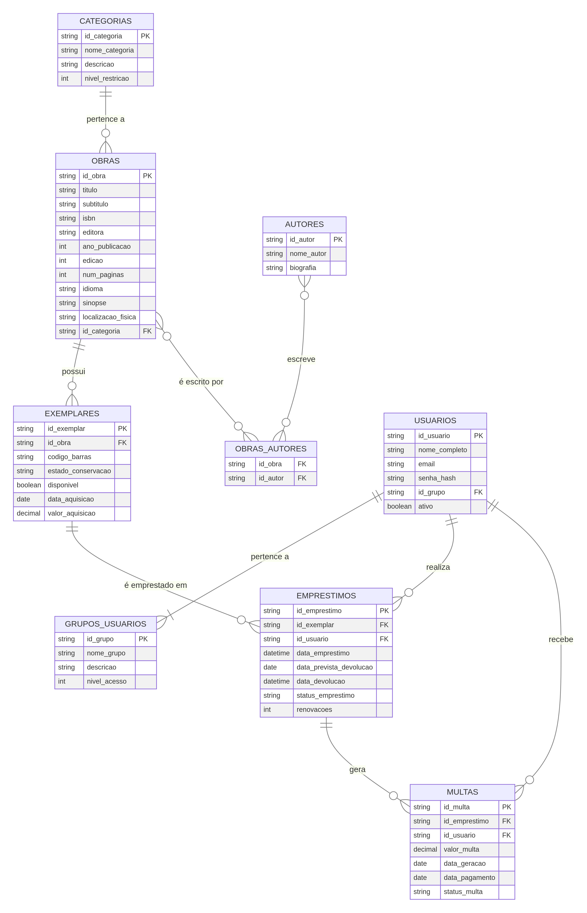

# 📚 Biblioteca Imperial - Sistema de Gerenciamento de Bibliotecas

<div align="center">


**Sistema de Gerenciamento de Bibliotecas com Arquitetura Híbrida e Controle de Acesso Hierárquico**

</div>

---

## 📋 Sobre o Projeto

O **Biblioteca Imperial** é um Sistema de Gerenciamento de Bibliotecas (SGB) moderno e escalável, desenvolvido como projeto acadêmico para a disciplina de **Laboratório de Banco de Dados** do curso de **Engenharia de Software** (4º semestre). O sistema foi inspirado no universo de Warhammer 40.000 e implementa uma arquitetura híbrida inovadora, combinando bancos de dados relacionais (MySQL) e NoSQL (MongoDB).

### 🎯 Objetivos do Projeto

- Implementar um sistema completo de gerenciamento de acervo bibliotecário
- Demonstrar a aplicação prática de conceitos de banco de dados relacionais e NoSQL
- Desenvolver uma arquitetura de software robusta e escalável
- Implementar controle de acesso hierárquico com 5 níveis de permissões
- Aplicar boas práticas de engenharia de software e desenvolvimento ágil

### ✨ Principais Funcionalidades

- 📖 **Gestão de Acervo**: CRUD completo de obras, autores, categorias e exemplares
- 🔄 **Controle de Empréstimos**: Solicitação, devolução e renovação de livros
- 👤 **Gestão de Usuários**: Sistema de autenticação e autorização com JWT
- 🔐 **Controle de Acesso Hierárquico**: 5 níveis de permissões (Leitor → Sigillita)
- 💰 **Sistema de Multas**: Cálculo automático de multas por atraso
- 📊 **Painel Administrativo**: Estatísticas e relatórios em tempo real
- 🔍 **Auditoria**: Logs completos de todas as operações no MongoDB

---

## 🏗️ Arquitetura do Sistema

O projeto utiliza uma **arquitetura multicamadas** com separação clara de responsabilidades:

```
┌─────────────────────────────────────────────────────────────┐
│                    CAMADA DE APRESENTAÇÃO                    │
│              (Frontend - HTML/CSS/JavaScript)                │
└──────────────────────┬──────────────────────────────────────┘
                       │ API RESTful (JSON)
┌──────────────────────┴──────────────────────────────────────┐
│                     CAMADA DE NEGÓCIO                        │
│              (Backend - Spring Boot / Java)                  │
│  ┌──────────────┐  ┌──────────────┐  ┌──────────────┐      │
│  │ Controllers  │  │   Services   │  │ Repositories │      │
│  └──────────────┘  └──────────────┘  └──────────────┘      │
└──────────────────────┬──────────────────────────────────────┘
                       │
        ┌──────────────┴──────────────┐
        │                             │
┌───────┴────────┐           ┌────────┴────────┐
│  MySQL (SGBDR) │           │ MongoDB (NoSQL) │
│  Dados Trans.  │           │  Logs Audit.    │
└────────────────┘           └─────────────────┘
```

### 🔧 Tecnologias Utilizadas

#### Backend
- **Java 21** - Linguagem de programação
- **Spring Boot 3.1.5** - Framework para desenvolvimento de aplicações
- **Spring Data JPA** - Abstração para acesso a dados relacionais
- **Spring Security** - Framework de segurança e autenticação
- **Maven** - Gerenciador de dependências

#### Frontend
- **HTML5** - Estrutura das páginas
- **CSS3** - Estilização (tema Warhammer 40K)
- **JavaScript (Vanilla)** - Lógica e interação com API

#### Bancos de Dados
- **MySQL 8.0** - Dados transacionais (obras, usuários, empréstimos)
- **MongoDB 7.0** - Logs de auditoria e histórico

#### Ferramentas
- **Git & GitHub** - Controle de versão
- **Postman** - Testes de API
- **MySQL Workbench** - Administração do banco de dados
- **IntelliJ IDEA** - IDE de desenvolvimento

---

## 🎭 Controle de Acesso Hierárquico

O sistema implementa 5 níveis hierárquicos de acesso, inspirados na hierarquia do Adeptus Terra:

| Nível | Papel | Permissões |
|:---:|:---|:---|
| 1️⃣ | **Leitor** | Buscar obras, solicitar empréstimos, devolver livros |
| 2️⃣ | **Escriba** | Leitor + Gerenciar acervo (CRUD de obras/autores/categorias) |
| 3️⃣ | **Lexicanum** | Escriba + Visualizar todos os empréstimos, gerar relatórios |
| 4️⃣ | **Inquisidor** | Lexicanum + Gerenciar usuários, visualizar logs de auditoria |
| 5️⃣ | **Sigillita** | Acesso total ao sistema, incluindo configurações avançadas |

---

## 📊 Modelagem do Banco de Dados

### Diagrama Entidade-Relacionamento (DER)



### Principais Entidades

- **GRUPOS_USUARIOS**: Papéis e níveis de acesso
- **USUARIOS**: Dados dos usuários do sistema
- **OBRAS**: Informações bibliográficas das obras
- **AUTORES**: Autores das obras (relacionamento N:N)
- **CATEGORIAS**: Categorias temáticas
- **EXEMPLARES**: Cópias físicas das obras
- **EMPRESTIMOS**: Registros de empréstimos
- **MULTAS**: Multas por atraso na devolução

### Recursos Avançados

- ✅ **Triggers**: Atualização automática de disponibilidade de exemplares
- ✅ **Views**: Relatórios consolidados de empréstimos ativos
- ✅ **Stored Procedures**: Lógica de devolução com cálculo de multas
- ✅ **Índices**: Otimização de consultas frequentes
